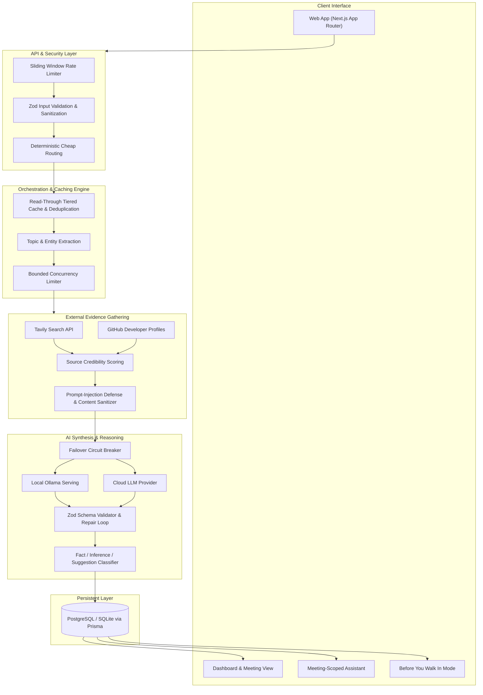

# BeforeCall — Walk Into Every Meeting Prepared

> **Research the people. Understand the context. Know what to ask.**

BeforeCall is an intelligent meeting preparation and briefing platform. It turns meeting agendas, participant lists, and subject matter into structured, evidence-backed briefings before you join a call or step into a room.

---

## What is BeforeCall?

Professionals often enter high-stakes meetings with fragmented or unverified information about their counter-parties, recent company developments, and key agenda topics. Manual background research is tedious and time-consuming.

**BeforeCall automates pre-meeting intelligence:**
- **Attendee Intelligence**: Identifies professional background, role history, open-source or public contributions, and relevant focus areas.
- **Company & Domain Context**: Synthesizes company overviews, key initiatives, strategic priorities, and recent news.
- **Structured Briefing Generation**: Produces a synthesized brief containing an executive TL;DR, high-priority talking points, conversation openers, critical questions, and watch-outs.
- **Evidence-Backed Attribution**: Distinguishes verified facts from inferences and strategic suggestions, with direct citations for every factual claim.
- **Meeting-Scoped Interactive Assistant**: A dedicated chat assistant anchored strictly to the verified brief and attendee context to answer tactical questions before the call.
- **Multiple Briefing Modes**: Includes standard comprehensive views, condensed executive summaries, and mobile-friendly "Before You Walk In" quick reviews.
- **Export & Portability**: Export briefs to clean Markdown for offline notes or shareable summaries.

---

## Application Flowchart

The following diagram illustrates the end-to-end architecture, data processing pipeline, and verification layers:



---

## Tech Stack

- **Frontend & App Framework**: Next.js App Router, React, Tailwind CSS, Radix UI Primitives, Lucide Icons.
- **Runtime & Language**: Node.js, TypeScript.
- **Database & Persistence**: Prisma ORM, PostgreSQL for production deployments, SQLite for local environments.
- **Research & Discovery**: Tavily Web Search API, GitHub REST API, domain verification heuristics.
- **Artificial Intelligence & LLM**:
  - Local GPU inference via Ollama.
  - Production cloud LLM provider integration.
  - Automatic circuit-breaker failover between remote and local models.
  - Zod structured output validation with automated repair loops.
- **Reliability & Caching**:
  - In-memory and tiered read-through caching.
  - Concurrent in-flight request deduplication.
  - Versioned database cache invalidation.
  - Sliding-window IP rate limiting with automatic pruning.

---

## What Makes BeforeCall Unique?

### 1. Separation of Fact, Inference, and Suggestion
Generic language models often blend confirmed facts with creative hallucinations. BeforeCall strictly classifies every assertion:
- **FACT**: Backed directly by cited, verified web and public sources.
- **INFERENCE**: Logical deductions derived from multiple sources, explicitly labeled as interpretations.
- **SUGGESTION**: Strategic recommendations and questions framed for conversational preparation.

### 2. Prompt-Injection Guardrails
External web content retrieved during research is classified strictly as untrusted evidence rather than instructions. The pipeline sanitizes web snippets and instructs reasoning models to disregard adversarial prompt-injection payloads found on the public internet.

### 3. Resilient Hybrid AI Architecture
SystemCall integrates a persistent circuit breaker:
- If a cloud endpoint is unreachable or delayed, the engine cuts over to local Ollama serving without dropping the user's session.
- Once the circuit opens, subsequent requests route immediately to the available model without blocking user requests.

### 4. Deterministic Cheap Routing First
Before issuing external network queries, the engine applies local parsing, regex matching, and database deduplication. If a meeting agenda or attendee has already been resolved or can be resolved locally, external network calls are avoided entirely.

### 5. Meeting-Scoped Context Boundaries
The in-meeting assistant operates strictly within the boundary of the researched evidence and agenda. It declines to answer unrelated speculative queries and focuses solely on strategic prep for the upcoming meeting.

---

## Getting Started (NPM Steps)

### Prerequisites
- Node.js (Active LTS version recommended)
- npm package manager
- (Optional for local inference) Ollama installed and serving locally

### 1. Clone the Repository
```bash
git clone https://github.com/VIKSIT-GARG/BeforeCall.git
cd BeforeCall
```

### 2. Install Dependencies
```bash
npm install
```

### 3. Configure Environment Variables
Copy the sample environment file to create your local `.env`:
```bash
cp .env.example .env
```
Configure your keys in `.env`:
- `DATABASE_URL`: Connection string for PostgreSQL or SQLite file path.
- `TAVILY_API_KEY`: Web research API key.
- `LLM_PROVIDER`: Choose `ollama` for zero-cost local inference or `production` for cloud models.
- `PRODUCTION_LLM_API_KEY`: API key for your hosted cloud provider.

### 4. Initialize Database
Generate the Prisma Client and sync the schema:
```bash
npm run db:push
```

### 5. Run Development Server
```bash
npm run dev
```
Open [http://localhost:3000](http://localhost:3000) in your browser.

### 6. Verify Code Quality & Tests
Run static typechecking:
```bash
npm run typecheck
```

Run ESLint:
```bash
npm run lint
```

Run test suite:
```bash
npm test
```

Run full quality check:
```bash
npm run check
```

### 7. Production Build & Run
To test the production build locally:
```bash
npm run build
npm start
```

---

## Where to Host BeforeCall

BeforeCall is fully containerized and cloud-ready. You can host it on any modern platform supporting Node.js and PostgreSQL:

### Option A: Render (Recommended — Config Included)
This repository includes a pre-configured [`render.yaml`](./render.yaml) file:
1. Connect your GitHub repository to [Render](https://render.com).
2. Create a new **Blueprint** deployment using the included `render.yaml`.
3. Render automatically provisions:
   - A Node.js Web Service running Next.js.
   - A managed PostgreSQL database.
4. Set your production secrets in the Render Dashboard (`TAVILY_API_KEY`, `PRODUCTION_LLM_API_KEY`).

### Option B: Vercel + Neon / Supabase
- Deploy the Next.js frontend to **Vercel** with automatic Git deployments.
- Connect a managed serverless PostgreSQL database from **Neon** or **Supabase**.
- Set environment variables in the Vercel Project Settings.

### Option C: Railway or Fly.io
- Deploy via Dockerfile or Nixpacks.
- Attach an attached PostgreSQL container or volume.
- Set the web service start command to `npm start`.

---

## License

MIT License. See [LICENSE](./LICENSE) for details.
